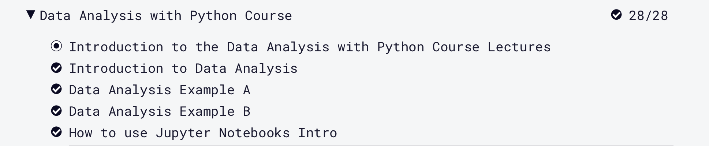

# Welcome to Abbys Page

Welcome to my page all about me, Abby!

***Get To Know Me***

An introduction to me and what I like!

**About Me**

-My name is Abby Robinson, I am from Chesterfield which 
is right outside of Richmond and I am a sophmore ISAT 
major. I have two sibblings, a brother and a sister,
and a dog named Pippi.

**My Interests**

-I am interested in going into a biotechnology field,
specifically into a cancer research field. I enjoy 
helping people and I am a part of an organization on 
campus call Camp Kesesm. We are a national non-profit 
that supports a child through and beyond a parents cancer.

**My Hobbies**

-I enjoy playing volleyball and swimming, both are sports
that I played in highschool. I like to paint, I find it
really relaxing and I have a wall in my bedroom with all
my little paintings on it. I also like to spend time with
friends and family and go to the beach.

Fun Fact: I have a tattoo on my back that is written in 
my moms handwritting!

**My Projects**

-I created a hello world program as my first project in this
course. This was my first attempt at programming with python.

-I created a unit convertor in python that converts Kilometers
per mile to gallons per liter.

-I completed the Python For Everbody course in freecodecamp which
consisted of videos and excerises.

-I completed the Data Analysis with Python course in freecodecamp
which consists of videos and exercices.

-Me and my team from this semester created a program using 
python that can be used when printing to promote people to
be enrionementally concious. It works by a pop up asking
if the user really wants to rpint and if they select yes a
environemtnal facts and image show up to try to persuade them
to not print and save trees. This is the link to the executable
zip folder to download the program as well as images of it working.
https://urldefense.proofpoint.com/v2/url?u=https-3A__drive.google.com_file_d_1QgmYS9QaXi-2DSD9FakUBb0nSIxKkcv3DE_view-3Fusp-3Ddrive-5Fweb&d=DwMFaQ&c=RWKzQL7PIkYKzsYSjZn54yrN72ooGPhHwUXdJ0S2Irw&r=rNcuIlvVqR-EzKZxQxsJIuqrW9tUXtB7N46w-QyR2BM&m=7mJmUdOzIEZBULy_-9-OoE2R2HiFeXrVXFzAr-VrJbc&s=YVpncfIqUIsjZfOwuUZ9Ga9L5OkQxfR0ziuynWv8Nhk&e=

-My reflective narrative for the semester is posted at this
link
https://docs.google.com/document/d/1947ut-ojN1qV8ZdYzDZNWAelPJJz8R29f2y_ChnygZI/edit

**Photo Gallery**

**Thanks For Visiting!**

